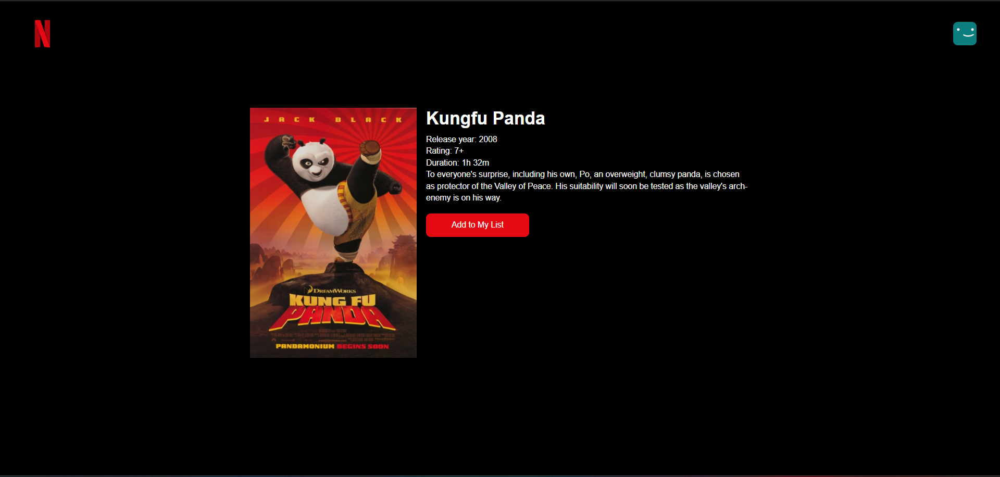

Nedfliks
=========================================================

#### Table of Contents
- [About](#about)
- [Getting Started](#getting-started)
   - [Prerequisites](#prerequisites)
   - [Install Required Dependencies](#install-required-dependencies)
   - [Pre-populating Data](#pre-populating-data)
   - [Run](#run)
- [Screenshots](#screenshots)
- [Author](#author)

## About
Nedfliks is a clone of Netflix, a renowned streaming site that provides on-demand access to a vast library of movies, TV shows, 
documentaries, and original contents. Nedfliks web application covers main features of Netflix homepage, including authentication, 
show details, and watchlist. Users can sign up and log in in to the site to view available shows provided by Nedfliks service and 
add them to their watchlist.

## Getting Started

### Prerequisites

To run this web app, you need to install
- [Laravel](https://laravel.com/docs/10.x/installation), a PHP web framework
- [npm](https://docs.npmjs.com/downloading-and-installing-node-js-and-npm), a Javascript package manager
- [MySQL](https://www.mysql.com/downloads/), a relational database management system

### Install Required Dependencies

To install required dependencies, simply run

```shell
composer install
npm install
```

### Pre-populating data

To pre-populate data, create a `.env` file by duplicating and renaming provided `.env.example` file. Then, modify required 
environment variable for database connection and run
```shell
php artisan migrate:fresh --seed
```

### Run

After installing required dependencies and populating the data, run

```shell
npm run dev
```

and

```shell
php artisan serve
```

## Screenshots

These are some screen captures of Nedfliks UI on various pages.
1. Login

2. Register

3. Homepage


4. Show detail

5. Watchlist

6. Profile

7. Change password


## Author
Fernaldy
